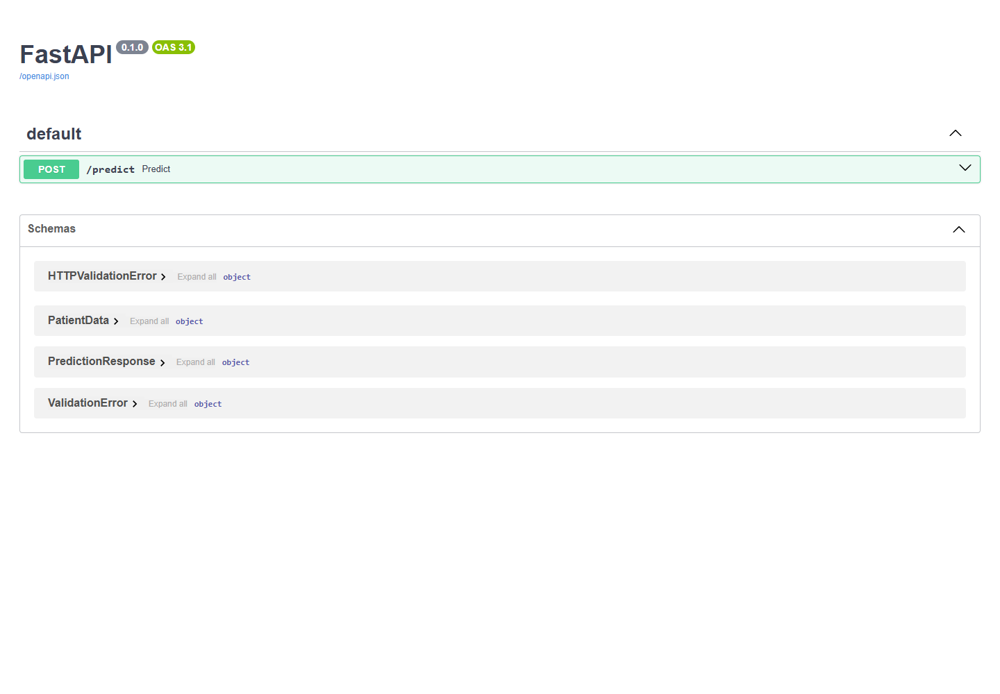
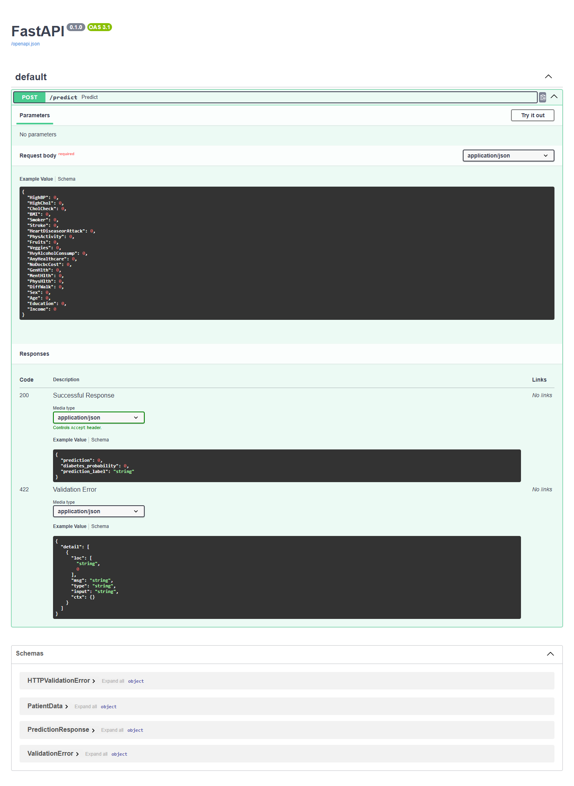

# Diabetes Risk Prediction

This project predicts a person's diabetes risk using survey-style health data and a trained machine learning ensemble model.

The work includes the training project structure and a small FastAPI app that makes a locally available trained model available through an API.

## What We Built

- Trained and saved a Random Forest undersampling ensemble model.
- Loads the final model from `models/random_forest_undersampling_ensemble_threshold_060.joblib`.
- Created a FastAPI app in `app/main.py`.
- Added a `/predict` endpoint that accepts patient health features and returns:
  - the predicted class
  - the diabetes probability
  - a human-readable prediction label

## Project Structure

```text
diabetes-risk-prediction/
+-- app/
|   +-- main.py
+-- data/
+-- models/
|   +-- random_forest_undersampling_ensemble_threshold_060.joblib  (not included in GitHub)
+-- notebooks/
+-- reports/
|   +-- screenshots/
+-- src/
+-- requirements.txt
+-- README.md
```

## Model File

The trained model file is not included in this repository because it is too large for GitHub.

To run the API locally, place the model file here:

```text
models/random_forest_undersampling_ensemble_threshold_060.joblib
```

## How To Run The API

Open PowerShell in the project folder:

```powershell
cd "C:\Users\cs\Desktop\diabetes-risk-prediction"
```

Install the required packages:

```powershell
pip install -r requirements.txt
```

Start the API:

```powershell
python -m uvicorn app.main:app --host 127.0.0.1 --port 8000
```

Or build and run it with Docker:

```powershell
docker build -t diabetes-risk-api .
docker run -d --name diabetes-risk-api-test -p 8000:8000 -v "${PWD}\models:/app/models:ro" diabetes-risk-api
```

Then open the API docs:

```text
http://127.0.0.1:8000/docs
```

## Swagger API Docs





## Example Request

Use the `/predict` endpoint with JSON like this:

```json
{
  "HighBP": 1,
  "HighChol": 1,
  "CholCheck": 1,
  "BMI": 28.5,
  "Smoker": 0,
  "Stroke": 0,
  "HeartDiseaseorAttack": 0,
  "PhysActivity": 1,
  "Fruits": 1,
  "Veggies": 1,
  "HvyAlcoholConsump": 0,
  "AnyHealthcare": 1,
  "NoDocbcCost": 0,
  "GenHlth": 3,
  "MentHlth": 0,
  "PhysHlth": 2,
  "DiffWalk": 0,
  "Sex": 1,
  "Age": 8,
  "Education": 5,
  "Income": 6
}
```

Example response:

```json
{
  "prediction": 1,
  "diabetes_probability": 0.7935,
  "prediction_label": "Prediabetes or diabetes"
}
```

## Notes

The model file is large, so it is best to run the API without `--reload`.

This API is intended for project demonstration and experimentation, not for medical diagnosis.
